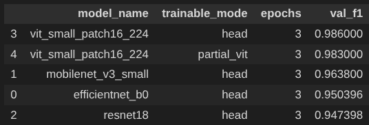

# Cat and Dog Classification Report

## Problem

The goal is to build a Python image-classification solution that receives an image file and predicts whether the image contains a cat or a dog. The model may be evaluated on a private dataset, so the solution should generalize beyond the training images.

## Dataset

I used the public Kaggle dataset `bhavikjikadara/dog-and-cat-classification-dataset`, downloaded with KaggleHub. The dataset is organized as:

```text
PetImages/
  Cat/
  Dog/
```

The images are loaded with PyTorch/Torchvision using an ImageFolder-style pipeline. The data is split into training and validation subsets with a fixed random seed so the experiments are reproducible.

## Pipeline

The pipeline has these steps:

1. Download the dataset with KaggleHub.
2. Load images from `PetImages/Cat` and `PetImages/Dog`.
3. Resize images to `224x224`.
4. Apply ImageNet normalization.
5. Train multiple pretrained models using transfer learning.
6. Evaluate each model on the validation set.
7. Compare validation metrics and choose the best practical model.
8. Save model checkpoints.
9. Serve the final model through a FastAPI backend and a static Netlify frontend.

For training, I used data augmentation such as horizontal flip and stronger augmentation experiments with random crop, color jitter, and rotation.

## Result



## Algorithms and Models

The solution uses transfer learning with pretrained computer vision models. Instead of training a model from scratch, pretrained ImageNet backbones are reused and adapted to binary classification.

Experiments included:

- ResNet18 with a replaced classification head
- MobileNetV3-Small with a replaced classification head
- EfficientNet-B0 with a replaced classification head
- ViT-Small head-only fine-tuning
- ViT-Small partial fine-tuning

The main training setup uses:

- PyTorch
- Cross-entropy loss
- AdamW optimizer
- Cosine learning-rate scheduling
- Accuracy and macro F1 score for validation

ViT-Small was tested because transformer-based models can perform well when pretrained. However, for deployment on Render free tier, MobileNetV3-Small is used because it is much lighter and avoids memory errors.

## Final Deployment Model

The deployed API uses:

```text
mobilenet_v3_small_head.pt
```

Reason:

- It is much smaller than the ViT checkpoint.
- It loads successfully on Render free tier.
- It gives fast inference for a web demo.
- It is suitable for the assignment requirement of classifying one uploaded image.

The frontend is deployed on Netlify and calls the Render backend:

```text
Netlify frontend -> Render /predict API -> model prediction -> result shown in browser
```

## Remaining Problems

There are still several limitations:

- The training dataset may contain noisy labels, duplicate images, corrupted files, or unusual images.
- The private evaluation dataset may have different lighting, image quality, backgrounds, breeds, or camera angles.
- The model only predicts two classes, so it will still force a `cat` or `dog` label even for unrelated images.
- Render free tier has limited memory, so larger models like ViT-Small are not ideal for production deployment there.
- Confidence scores are not calibrated, so a high score does not always mean the prediction is truly reliable.

## Ideas for Improvement

Future improvements:

- Clean the dataset by removing corrupted, duplicate, and mislabeled images.
- Use k-fold cross-validation for more stable model selection.
- Add an `unknown` class or confidence threshold for non-cat/non-dog images.
- Export the model to ONNX for lower-memory and faster CPU inference.
- Tune augmentation, learning rate, batch size, and fine-tuning depth.
- Try model ensembling if inference speed and memory are not constraints.
- Deploy the larger ViT model on a paid instance or GPU service if higher accuracy is required.

## Conclusion

The final solution uses a reproducible PyTorch transfer-learning pipeline, compares several CNN and transformer-based models, and deploys a practical MobileNetV3-Small classifier through Render and Netlify. This satisfies the requirement of accepting an image file and returning a cat/dog prediction while remaining simple enough to reproduce and deploy.
